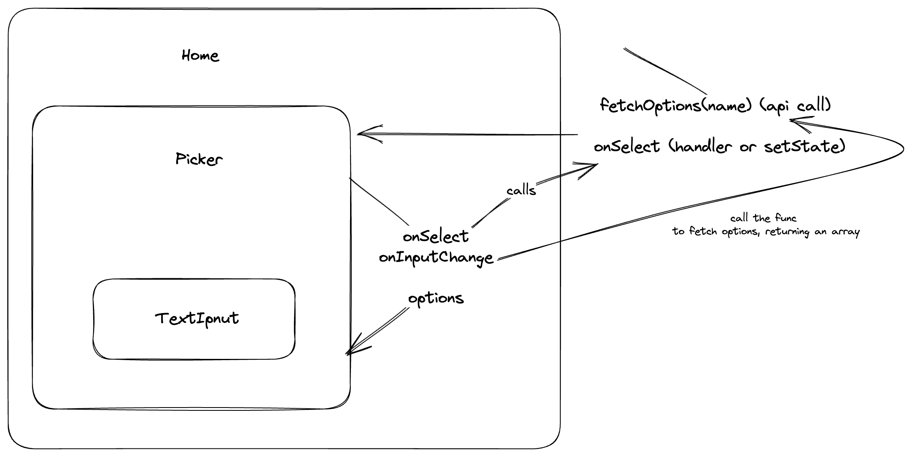

🚀 **Live demo:** https://waellaataoui-assessment.vercel.app/
📚 **Technologies used:**

- Framework : Next.js
- Styling : Sass
- Map: Leaflet
- Deployment: Vercel

🧠 **Decisions:**
I had to overcome a CORS problem to fetch the data from the server. To do so, I used a self-hosted instance of [CORS Anywhere](https://github.com/Rob--W/cors-anywhere).
**NOTE!!**
**If you experience any latency while fetching the data for the first time, it's due to the cold start of the proxy server (I'm using a free service called “Render” to host it), using a Chrome extension like [Allow Cors](https://chrome.google.com/webstore/detail/allow-cors-access-control/lhobafahddgcelffkeicbaginigeejlf) should reflect the real performance of the demo.**

`<ins>`The UI :`</ins>`
To favor reusability, I divided the search logic into 2 components, one that handles the data fetching (the Picker component) and the other to get the user's input and to display the options list (the TextInput component).
I included a little Mockup that I drew before starting this demo to engineer the logic behind the assessment. Feel free to give it a look if you like.

After getting the selected option from the user, the location is displayed into a leaflet map using the corresponding coordinates.
